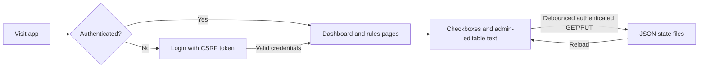

# Chores & Rules — Project Summary

This is a private PHP web app for household chores, screen time, behavior rules, rewards, and definitions. The browser serves the frontend from `public/`. UI includes (shared UI helpers such as buttons and page menus) live in `public/includes/`, while non-UI includes (authentication, sessions, configuration, database, rate limiting, and JSON storage) remain in the root `includes/` directory. Authenticated users see the rules dashboard and pages. The app supports `admin` and `kid` roles.

## Current functionality

- Login uses MySQL user records and `password_verify()`.
- Successful login creates a 30-day, HttpOnly, SameSite=Lax session. Login forms use CSRF tokens.
- Login attempts are limited to four per IP in ten minutes. Failed attempts are stored in MySQL and written to `logs/auth.log` for Fail2Ban-compatible monitoring. A daily cron job removes old attempt records.
- Protected PHP pages and JSON APIs require authentication. CSS, JavaScript, images, and other static assets remain publicly served. `public/test-php.php` is a development diagnostics page and must not be exposed in production.
- Checkbox and editable-text state is stored in JSON files under `data/`. The APIs support authenticated `GET` and single-key `PUT` operations. Writes use file locking and atomic replacement.
- State loading and saving is handled by `public/js/persistence.js`, with debounced saves, retrying state loads, save/load notifications, and save flushing when leaving a page.
- A bottom progress bar tracks completed chores against the current trackable chore total using the persisted checkbox and editable-text state. On `chores-table.php`, fireworks celebrate when the progress reaches 100%.
- `admin` users can edit chore text and restricted consequence checkboxes. `kid` users can check ordinary chores but cannot edit chore text or restricted consequence checkboxes.
- Council name and phone are injected into `public/pages/main/main-rules.php` from environment variables at request time.
- Docker runs Apache with PHP 8.5 and PDO MySQL. Docker Compose runs the app and MySQL, seeds one required admin, an optional second admin, and one kid user on first database initialization, and mounts persistent data and logs.

## Main paths

- `public/` — webroot and frontend pages.
- `api/` — authenticated API implementations; `public/api/` contains webroot wrappers.
- `includes/` — non-UI includes: authentication, sessions, configuration, database, rate limiting, and JSON storage.
- `public/includes/` — UI includes: shared UI helpers such as buttons and page menus.
- `docker/` — Dockerfile and MySQL initialization scripts.
- `data/` — persisted checkbox/text JSON state.
- `logs/` — authentication and cleanup logs.

## Request flow

